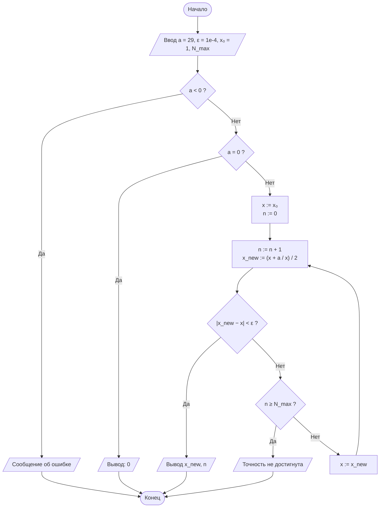
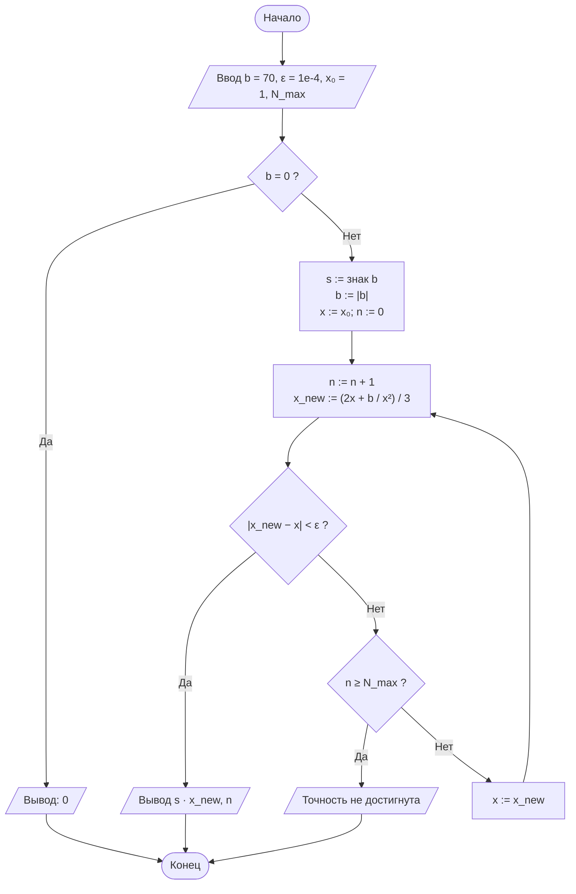
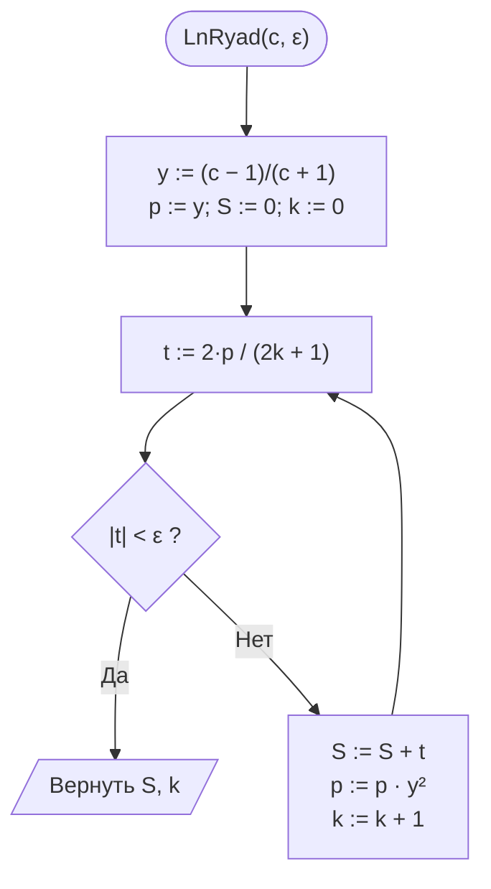
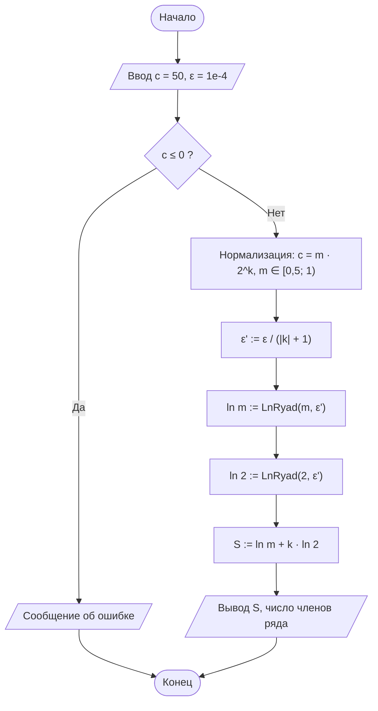

# Лабораторная работа № 1

## Итерационные методы вычисления элементарных функций: квадратный корень, кубический корень и натуральный логарифм

**Вариант:** 11
**Дисциплина:** Теория алгоритмов
**Направление подготовки:** 38.03.05 «Бизнес-информатика»
**Выполнил(а):** Мясников Андрей Дмитриевич (ФИО), группа БИ 2-3


---

## 1. Цель работы

Сформировать представление об итерационных алгоритмах как о вычислительных процедурах, результат которых достигается последовательным уточнением приближений, и освоить приёмы оценки их сходимости и трудоёмкости.

**Задачи:**

1. Изучить понятия итерационного процесса, начального приближения, критерия остановки и скорости сходимости.
2. Реализовать алгоритмы вычисления $\sqrt{a}$ и $\sqrt[3]{b}$ методом Ньютона, а также $\ln c$ методом разложения в степенной ряд.
3. Экспериментально определить число итераций, необходимое для достижения заданной точности $\varepsilon$.
4. Сравнить полученные значения с эталонными значениями стандартной библиотеки (`math`) и оценить абсолютную погрешность.

---

## 2. Формулировка задания (вариант 11)

Вычислить $\sqrt{29}$, $\sqrt[3]{70}$ и $\ln 50$ с точностью $\varepsilon = 10^{-4}$.

**Таблица 1. Исходные данные варианта 11**

| № | $a$ для $\sqrt{a}$ | $b$ для $\sqrt[3]{b}$ | $c$ для $\ln c$ | $\varepsilon$ | Критерий | $x_0$ | Доп. |
|---|---|---|---|---|---|---|---|
| 11 | 29 | 70 | 50 | $10^{-4}$ | Р | $x_0 = 1$ | Д3 |

- Критерий остановки для корней (Р) — по разности соседних приближений: $\lvert x_{n+1} - x_n \rvert < \varepsilon$.
- Начальное приближение для обоих методов Ньютона: $x_0 = 1$.
- Для логарифма используется критерий по модулю члена ряда: $\lvert t_k \rvert < \varepsilon$.
- **Дополнительное требование Д3:** реализовать вычисление $\ln c$ с нормализацией аргумента ($c = m \cdot 2^k$) и сравнить число итераций с ненормализованным вариантом.
- Внутри вычислительных функций не используются `math.sqrt`, `math.log`, `**0.5` и аналоги; модуль `math` применяется только для получения эталонных значений.

---

## 3. Краткие теоретические сведения

### 3.1. Итерационный алгоритм

Итерационный алгоритм строит последовательность приближений

$$x_0,\ x_1,\ x_2,\ \ldots,\ x_n,\ \ldots, \qquad x_{n+1} = \varphi(x_n).$$

Он определяется тремя элементами: начальным приближением $x_0$, итерационной формулой $\varphi$ и критерием остановки. Свойство *результативности* (завершение за конечное число шагов) обеспечивается критерием остановки и предельным числом итераций $N_{\max}$.

### 3.2. Метод Ньютона

Для уравнения $F(x) = 0$:

$$x_{n+1} = x_n - \frac{F(x_n)}{F'(x_n)}.$$

**Квадратный корень.** При $F(x) = x^2 - a$ получаем формулу Герона:

$$x_{n+1} = \frac{1}{2}\left(x_n + \frac{a}{x_n}\right).$$

**Кубический корень.** При $F(x) = x^3 - b$:

$$x_{n+1} = \frac{1}{3}\left(2x_n + \frac{b}{x_n^2}\right).$$

Для $b < 0$ используется $\sqrt[3]{b} = -\sqrt[3]{\lvert b \rvert}$. В варианте 11 $b = 70 > 0$.

Метод обладает квадратичной сходимостью ($p = 2$): вблизи корня число верных знаков примерно удваивается на каждой итерации.

### 3.3. Натуральный логарифм через ряд

$$\ln c = 2\left(y + \frac{y^3}{3} + \frac{y^5}{5} + \frac{y^7}{7} + \ldots\right), \qquad y = \frac{c-1}{c+1}.$$

Для любого $c > 0$ выполняется $\lvert y \rvert < 1$, поэтому ряд сходится. Члены вычисляются итеративно, степень обновляется умножением на $y^2$:

$$t_k = \frac{2\,y^{2k+1}}{2k+1}.$$

Суммирование прекращается при $\lvert t_k \rvert < \varepsilon$. Сходимость линейная, со знаменателем прогрессии $y^2$: чем ближе $\lvert y \rvert$ к единице, тем медленнее.

Для $c = 50$: $y = 49/51 \approx 0{,}961$, $y^2 \approx 0{,}923$ — сходимость очень медленная.

### 3.4. Нормализация аргумента (Д3)

Аргумент представляется в виде

$$c = m \cdot 2^k, \qquad m \in [0{,}5;\ 1),$$

тогда $\ln c = \ln m + k \ln 2$. Для $m \in [0{,}5; 1)$ имеем $\lvert y \rvert \le 1/3$, а для $c = 2$ значение $y = 1/3$, поэтому оба слагаемых вычисляются рядом быстро.

Поскольку $\ln 2$ умножается на $k$, погрешность этого слагаемого возрастает в $\lvert k \rvert$ раз. Чтобы суммарная погрешность не превысила $\varepsilon$, каждое слагаемое вычисляется с точностью

$$\varepsilon' = \frac{\varepsilon}{\lvert k \rvert + 1}.$$

Для $c = 50$: $50 = 0{,}78125 \cdot 2^6$, то есть $m = 0{,}78125$, $k = 6$.

---

## 4. Блок-схемы алгоритмов

### 4.1. Вычисление $\sqrt{a}$ методом Ньютона



### 4.2. Вычисление $\sqrt[3]{b}$ методом Ньютона



### 4.3. Подпрограмма LnRyad — ряд для $\ln c$



### 4.4. Вычисление $\ln c$ с нормализацией аргумента (Д3)



---

## 5. Листинг программы

```python
"""
Лабораторная работа № 1. Вариант 11.
Итерационные методы вычисления √a, ∛b, ln c.

Исходные данные: a = 29, b = 70, c = 50, eps = 1e-4,
критерий остановки для корней - по разности соседних приближений (Р),
начальное приближение x0 = 1, дополнительное требование Д3
(нормализация аргумента логарифма c = m * 2^k).
"""
import math  # ТОЛЬКО для эталонных значений

A, B, C = 29, 70, 50
EPS = 1e-4
X0 = 1.0
N_MAX = 100


def sqrt_newton(a, eps=EPS, x0=X0, n_max=N_MAX):
    """Квадратный корень методом Ньютона (формула Герона)."""
    if a < 0:
        raise ValueError("Подкоренное выражение должно быть неотрицательным")
    if a == 0:
        return 0.0, 0
    x = x0
    for n in range(1, n_max + 1):
        x_new = 0.5 * (x + a / x)
        if abs(x_new - x) < eps:          # критерий Р
            return x_new, n
        x = x_new
    raise RuntimeError("Точность не достигнута за N_MAX итераций")


def cbrt_newton(b, eps=EPS, x0=X0, n_max=N_MAX):
    """Кубический корень методом Ньютона (с учётом знака)."""
    if b == 0:
        return 0.0, 0
    sign = -1 if b < 0 else 1
    b = abs(b)
    x = x0
    for n in range(1, n_max + 1):
        x_new = (2 * x + b / (x * x)) / 3
        if abs(x_new - x) < eps:          # критерий Р
            return sign * x_new, n
        x = x_new
    raise RuntimeError("Точность не достигнута за N_MAX итераций")


def ln_series(c, eps=EPS, n_max=10_000):
    """ln c через ряд: ln c = 2(y + y^3/3 + y^5/5 + ...), y=(c-1)/(c+1)."""
    if c <= 0:
        raise ValueError("Аргумент логарифма должен быть положительным")
    y = (c - 1) / (c + 1)
    y2 = y * y
    power = y                              # y^(2k+1)
    total = 0.0
    for k in range(n_max):
        term = 2 * power / (2 * k + 1)
        if abs(term) < eps:
            return total, k
        total += term
        power *= y2
    raise RuntimeError("Точность не достигнута за n_max итераций")


def normalize(c):
    """Представление c = m * 2^k, m in [0.5; 1). Только умножения/деления."""
    k = 0
    m = c
    while m >= 1:
        m /= 2
        k += 1
    while m < 0.5:
        m *= 2
        k -= 1
    return m, k


def ln_normalized(c, eps=EPS):
    """ln c = ln m + k ln 2 (оба логарифма считаются рядом, |y| <= 1/3).
    Точность делим на (|k|+1), чтобы погрешность k*ln2 не превысила eps."""
    if c <= 0:
        raise ValueError("Аргумент логарифма должен быть положительным")
    m, k = normalize(c)
    e = eps / (abs(k) + 1)
    ln_m, n1 = ln_series(m, e)
    ln_2, n2 = ln_series(2.0, e)
    return ln_m + k * ln_2, n1 + n2, (m, k, n1, n2)


def iteration_table(f_step, x0, target, eps):
    """Таблица итераций (для анализа сходимости)."""
    rows, x = [], x0
    for n in range(1, 100):
        x_new = f_step(x)
        rows.append((n, x_new, abs(x_new - x), abs(x_new - target)))
        if abs(x_new - x) < eps:
            break
        x = x_new
    return rows


if __name__ == "__main__":
    ref_sqrt, ref_cbrt, ref_ln = math.sqrt(A), B ** (1 / 3), math.log(C)

    s, ns = sqrt_newton(A)
    cb, nc = cbrt_newton(B)
    l1, nl1 = ln_series(C)
    l2, nl2, info = ln_normalized(C)

    print(f"{'Функция':<14}{'Арг.':>6}{'Результат':>16}{'Эталон':>16}"
          f"{'Погрешность':>14}{'Итер.':>7}")
    for name, arg, val, ref, n in [
        ("sqrt(a)", A, s, ref_sqrt, ns),
        ("cbrt(b)", B, cb, ref_cbrt, nc),
        ("ln c (ряд)", C, l1, ref_ln, nl1),
        ("ln c (норм.)", C, l2, ref_ln, nl2),
    ]:
        print(f"{name:<14}{arg:>6}{val:>16.10f}{ref:>16.10f}"
              f"{abs(val - ref):>14.2e}{n:>7}")
    m, k, n1, n2 = info
    print(f"Нормализация: c = {m} * 2^{k}, членов: ln m -> {n1}, ln 2 -> {n2}")

    print("\nТаблица итераций sqrt(29):")
    for r in iteration_table(lambda x: 0.5 * (x + A / x), X0, ref_sqrt, EPS):
        print("%3d %.10f %.3e %.3e" % r)
    print("\nТаблица итераций cbrt(70):")
    for r in iteration_table(lambda x: (2 * x + B / (x * x)) / 3, X0, ref_cbrt, EPS):
        print("%3d %.10f %.3e %.3e" % r)

    print("\nЗависимость числа итераций от eps:")
    for p in range(1, 11):
        e = 10.0 ** (-p)
        print(p, sqrt_newton(A, e)[1], cbrt_newton(B, e)[1],
              ln_series(C, e)[1], ln_normalized(C, e)[1])
```

---

## 6. Результаты расчётов

### 6.1. Основная таблица

**Таблица 2. Результаты вычислений (вариант 11, $\varepsilon = 10^{-4}$)**

| Функция | Аргумент | Результат | Эталон (`math`) | Абс. погрешность | Число итераций |
|---|---|---|---|---|---|
| $\sqrt{a}$ | 29 | 5,3851648075 | 5,3851648071 | $3{,}88 \cdot 10^{-10}$ | 6 |
| $\sqrt[3]{b}$ | 70 | 4,1212853006 | 4,1212852998 | $7{,}86 \cdot 10^{-10}$ | 9 |
| $\ln c$ (ряд, без нормализации) | 50 | 3,9109286139 | 3,9120230054 | $1{,}09 \cdot 10^{-3}$ | 63 |
| $\ln c$ (с нормализацией, Д3) | 50 | 3,9119597610 | 3,9120230054 | $6{,}32 \cdot 10^{-5}$ | 6 (2 + 4) |

Для нормализованного варианта: $c = 0{,}78125 \cdot 2^6$; на вычисление $\ln m$ ушло 2 члена ряда, на $\ln 2$ — 4 члена.

### 6.2. Итерации для $\sqrt{29}$ ($x_0 = 1$)

**Таблица 3.**

| $n$ | $x_n$ | $\lvert x_n - x_{n-1} \rvert$ | $\lvert x_n - \sqrt{29} \rvert$ |
|---|---|---|---|
| 1 | 15,0000000000 | $1,40 \cdot 10^{1}$ | $9,61 \cdot 10^{0}$ |
| 2 | 8,4666666667 | $6,53 \cdot 10^{0}$ | $3,08 \cdot 10^{0}$ |
| 3 | 5,9459317585 | $2,52 \cdot 10^{0}$ | $5,61 \cdot 10^{-1}$ |
| 4 | 5,4116080617 | $5,34 \cdot 10^{-1}$ | $2,64 \cdot 10^{-2}$ |
| 5 | 5,3852294132 | $2,64 \cdot 10^{-2}$ | $6,46 \cdot 10^{-5}$ |
| 6 | 5,3851648075 | $6,46 \cdot 10^{-5}$ | $3,88 \cdot 10^{-10}$ |

### 6.3. Итерации для $\sqrt[3]{70}$ ($x_0 = 1$)

**Таблица 4.**

| $n$ | $x_n$ | $\lvert x_n - x_{n-1} \rvert$ | $\lvert x_n - \sqrt[3]{70} \rvert$ |
|---|---|---|---|
| 1 | 24,0000000000 | $2,30 \cdot 10^{1}$ | $1,99 \cdot 10^{1}$ |
| 2 | 16,0405092593 | $7,96 \cdot 10^{0}$ | $1,19 \cdot 10^{1}$ |
| 3 | 10,7843588884 | $5,26 \cdot 10^{0}$ | $6,66 \cdot 10^{0}$ |
| 4 | 7,3901990111 | $3,39 \cdot 10^{0}$ | $3,27 \cdot 10^{0}$ |
| 5 | 5,3540320723 | $2,04 \cdot 10^{0}$ | $1,23 \cdot 10^{0}$ |
| 6 | 4,3833368034 | $9,71 \cdot 10^{-1}$ | $2,62 \cdot 10^{-1}$ |
| 7 | 4,1366394759 | $2,47 \cdot 10^{-1}$ | $1,54 \cdot 10^{-2}$ |
| 8 | 4,1213422202 | $1,53 \cdot 10^{-2}$ | $5,69 \cdot 10^{-5}$ |
| 9 | 4,1212853006 | $5,69 \cdot 10^{-5}$ | $7,86 \cdot 10^{-10}$ |

### 6.4. Сравнение вычисления $\ln 50$ с нормализацией и без неё (Д3)

**Таблица 5. Число итераций в зависимости от $\varepsilon$**

| $\varepsilon$ | $\sqrt{29}$ | $\sqrt[3]{70}$ | $\ln 50$ (ряд) | $\ln 50$ (с нормализацией) |
|---|---|---|---|---|
| $10^{-1}$ | 5 | 8 | 6 | 3 |
| $10^{-2}$ | 6 | 9 | 20 | 4 |
| $10^{-3}$ | 6 | 9 | 40 | 5 |
| $10^{-4}$ | 6 | 9 | 63 | 6 |
| $10^{-5}$ | 7 | 10 | 88 | 8 |
| $10^{-6}$ | 7 | 10 | 114 | 9 |
| $10^{-7}$ | 7 | 10 | 140 | 11 |
| $10^{-8}$ | 7 | 10 | 166 | 12 |
| $10^{-9}$ | 7 | 10 | 193 | 14 |
| $10^{-10}$ | 8 | 11 | 220 | 16 |


*Рис. 1. Число итераций в зависимости от $\varepsilon$ (логарифмические шкалы).*

---

## 7. Анализ результатов и выводы

1. Все алгоритмы достигли заданной точности, за исключением ряда для $\ln 50$ без нормализации (см. п. 4). Для корней фактическая погрешность ($\approx 10^{-10}$) на шесть порядков меньше $\varepsilon = 10^{-4}$. Это следствие квадратичной сходимости: к моменту выполнения критерия разность соседних приближений равна погрешности предыдущего шага ($6{,}46 \cdot 10^{-5}$), а погрешность текущего шага примерно равна её квадрату, умноженному на константу ($3{,}88 \cdot 10^{-10}$).

2. По таблицам итераций видно два режима метода Ньютона. Пока $x_n$ далеко от корня, сходимость близка к линейной: для $\sqrt{29}$ значения убывают $15 \to 8{,}47 \to 5{,}95$, для $\sqrt[3]{70}$ — примерно в 1,5 раза за шаг. Вблизи корня наступает квадратичный режим: погрешность $\sqrt{29}$ идёт $2{,}64 \cdot 10^{-2} \to 6{,}46 \cdot 10^{-5} \to 3{,}88 \cdot 10^{-10}$, то есть число верных знаков удваивается.

3. Для $\sqrt[3]{70}$ потребовалось 9 итераций против 6 для $\sqrt{29}$. Причина — неудачное начальное приближение $x_0 = 1$: первый шаг кубической формулы даёт $(2 + 70)/3 = 24$, то есть уводит приближение далеко от корня $\approx 4{,}12$, и на возвращение к нему требуется несколько «медленных» итераций.

4. Ряд для $\ln 50$ без нормализации сходится линейно и медленно: $y \approx 0{,}961$, $y^2 \approx 0{,}923$, потребовалось 63 члена. Фактическая погрешность ($1{,}09 \cdot 10^{-3}$) **превысила** $\varepsilon$. Причина: остаток ряда примерно равен последнему отброшенному члену, делённому на $1 - y^2 \approx 0{,}077$, то есть примерно в 13 раз больше его. Следовательно, критерий «$\lvert t_k \rvert < \varepsilon$» гарантирует точность лишь при быстро сходящемся ряде.

5. Нормализация аргумента (Д3) сократила число членов с 63 до 6 (примерно в 10 раз), а погрешность уменьшилась до $6{,}32 \cdot 10^{-5} < \varepsilon$. Выигрыш растёт с повышением точности: при $\varepsilon = 10^{-10}$ требуется 16 членов вместо 220. Число членов ряда растёт пропорционально $\log(1/\varepsilon)$, а число итераций метода Ньютона почти не меняется (5–8 итераций для $\sqrt{29}$ во всём диапазоне), что соответствует теоретическим оценкам $O(\log\log(1/\varepsilon))$ и $O(\log(1/\varepsilon))$.

6. **Итог.** Для вычисления корней метод Ньютона высокоэффективен; степенной ряд для логарифма целесообразно применять только совместно с нормализацией аргумента, согласуя точность слагаемых с общей точностью $\varepsilon$.

---

## 8. Ответы на контрольные вопросы

1. **Итерационный алгоритм** строит последовательность приближений $x_{n+1} = \varphi(x_n)$, предел которой — искомая величина. Дискретность (шаги), детерминированность (одинаковый результат при одинаковых данных) и массовость (работает для любых допустимых $a$, $b$, $c$) выполняются; результативность обеспечивается критерием остановки и ограничением $N_{\max}$.
2. **Формула Герона:** $F(x) = x^2 - a$, $F'(x) = 2x$, откуда $x_{n+1} = x_n - \dfrac{x_n^2 - a}{2x_n} = \dfrac{1}{2}\left(x_n + \dfrac{a}{x_n}\right)$.
3. **Критерии остановки.** По разности проверяется, насколько сдвинулось приближение; по невязке — насколько точно выполняется уравнение $F(x) = 0$. Результаты могут различаться: при пологой $F(x)$ малая невязка не означает малой погрешности по $x$, а малый шаг возможен и вдали от корня при медленной сходимости.
4. **Порядок сходимости** $p$: $e_{n+1} \approx C e_n^p$. У метода Ньютона $p = 2$, у половинного деления $p = 1$, поэтому Ньютон сходится быстрее.
5. **Начальное приближение** влияет на число итераций: при $x_0 = 1$ и корне $\approx 5{,}39$ для $\sqrt{29}$ потребовалось 6 итераций, для $\sqrt[3]{70}$ — 9 (первый шаг «выбросил» приближение до 24). Более близкое к корню $x_0$ сократило бы число шагов.
6. **Ряд $\ln(1+x)$** для $\ln 100$ не подходит: нужно $x = 99$, а он сходится только при $-1 < x \le 1$. Ряд по $y = (c-1)/(c+1)$ имеет $\lvert y \rvert < 1$ при любом $c > 0$.
7. **Смысл нормализации** — привести аргумент к диапазону, где $\lvert y \rvert$ мал и ряд сходится быстро: $\ln c = \ln m + k \ln 2$.
8. **Погрешность и $\varepsilon$.** Фактическая погрешность может быть намного меньше $\varepsilon$ (квадратичная сходимость, см. вывод 1) и может быть больше $\varepsilon$ (медленно сходящийся ряд: для $\ln 50$ без нормализации $1{,}09 \cdot 10^{-3} > 10^{-4}$).
9. **Ограничение $N_{\max}$** защищает от зацикливания при отсутствии сходимости (неудачное $x_0$, ошибки округления, некорректные данные).
10. **Пример из экономики:** расчёт внутренней нормы доходности IRR — решение уравнения $NPV(r) = 0$ методом Ньютона или секущих.

---

## 9. Литература

1. Кнут Д. Э. Искусство программирования. Т. 1. Основные алгоритмы. — 3-е изд. — М.: Вильямс, 2017.
2. Вирт Н. Алгоритмы и структуры данных. Новая версия для Оберона. — М.: ДМК Пресс, 2016.
3. Вержбицкий В. М. Основы численных методов. — М.: Высшая школа, 2009.
4. Бахвалов Н. С., Жидков Н. П., Кобельков Г. М. Численные методы. — 9-е изд. — М.: Лаборатория знаний, 2020.
5. ГОСТ 19.701-90 (ИСО 5807-85). ЕСПД. Схемы алгоритмов, программ, данных и систем. Условные обозначения и правила выполнения.