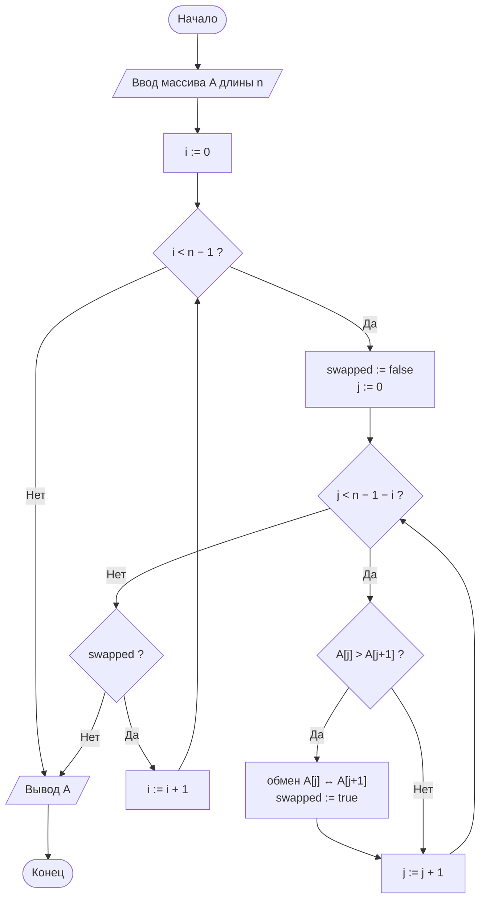
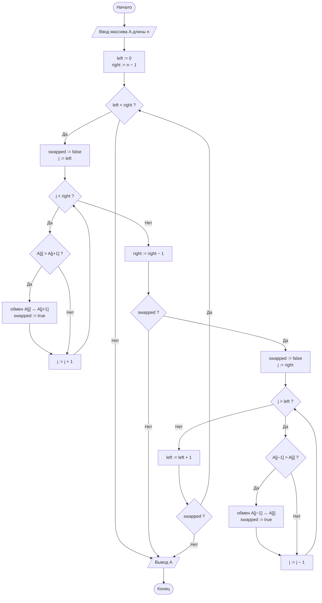
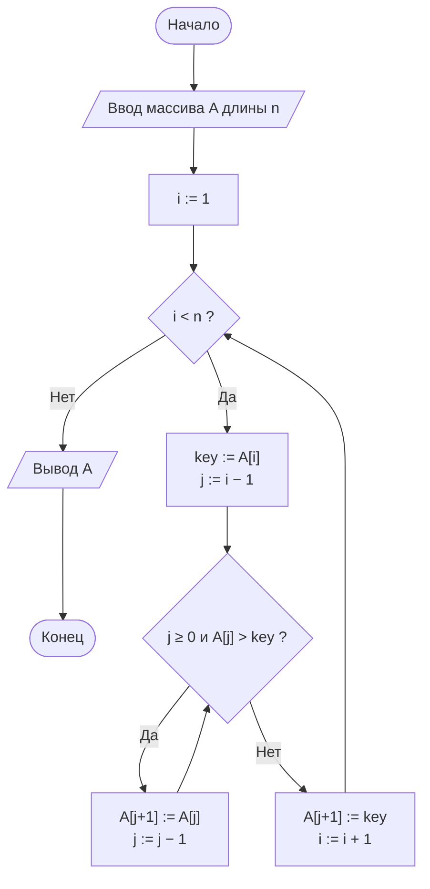

# Лабораторная работа № 2

## Эмпирический анализ временной сложности алгоритмов сортировки. Часть 1: квадратичные алгоритмы (сортировка обменом и сортировка вставками)

**Вариант:** 11
**Дисциплина:** Теория алгоритмов
**Направление подготовки:** 38.03.05 «Бизнес-информатика»
**Выполнил(а):** ____________________ (ФИО), группа ________
**Проверил(а):** ____________________

---

## 1. Цель работы

Освоить методику экспериментального исследования временной сложности алгоритмов и сопоставить полученные эмпирические зависимости с теоретическими асимптотическими оценками на примере простых алгоритмов сортировки.

**Задачи:**

1. Изучить понятия вычислительной сложности, асимптотических обозначений $O$, $\Omega$, $\Theta$, а также лучшего, среднего и худшего случаев.
2. Реализовать сортировку обменом («пузырьком») и сортировку вставками.
3. Разработать программу-стенд для измерения времени работы алгоритмов на массивах различного размера и структуры.
4. Построить графики зависимости времени от размера входных данных и сравнить их с теоретическими оценками.
5. Сформулировать выводы о применимости алгоритмов.

---

## 2. Задание варианта 11

**Таблица 1. Исходные данные варианта 11**

| № | Размеры массива $n$ | Тип данных | Диапазон значений | Повторов $k$ | Доп. задание |
|---|---|---|---|---|---|
| 11 | 1000, 2000, 3000, 4000 | D | [0; 10] | 3 | М5 |

- **Основное задание.** Сравнить время работы сортировки пузырьком (с флагом) и сортировки вставками на массивах типа **D** (случайные целые числа из узкого диапазона [0; 10], то есть с большим числом повторов) размером $n = 1000, 2000, 3000, 4000$. Каждое измерение повторить 3 раза и взять медиану.
- **Дополнительное задание М5.** Реализовать **шейкерную сортировку** (двунаправленный пузырёк) и сравнить её с классической сортировкой пузырьком.
- Функции сортировки не изменяют исходный массив (возвращают новый список). Корректность каждого результата проверяется сравнением с `sorted()`.

---

## 3. Краткое описание алгоритмов и теоретические оценки

### 3.1. Сортировка обменом («пузырьком»)

Массив многократно просматривается слева направо, соседние элементы сравниваются и при нарушении порядка меняются местами. После $i$-го прохода $i$ наибольших элементов занимают окончательные позиции в конце массива. **Оптимизация с флагом:** если за проход не выполнено ни одного обмена, массив упорядочен и работа завершается досрочно — алгоритм становится адаптивным.

### 3.2. Шейкерная сортировка (М5)

Модификация пузырька: проходы чередуются — вправо (наибольший элемент «всплывает» в конец) и влево (наименьший «тонет» в начало). После каждой пары проходов обе границы неупорядоченной части сжимаются. Благодаря обратному проходу малые элементы, стоящие в конце массива, перемещаются к началу за один проход, а не по одной позиции за проход, как в классическом пузырьке. Как и в классической версии, используется флаг досрочного выхода.

### 3.3. Сортировка вставками

Массив делится на отсортированную (левую) и неотсортированную (правую) части. Очередной элемент (*ключ*) вставляется в нужную позицию левой части: бóльшие элементы сдвигаются на одну позицию вправо. Число сдвигов равно числу **инверсий** — пар $(i, j)$, где $i < j$ и $A[i] > A[j]$.

### 3.4. Теоретические оценки

**Таблица 2. Теоретические оценки**

| Алгоритм | Лучший случай | Средний случай | Худший случай | Доп. память | Устойчивость |
|---|---|---|---|---|---|
| Пузырьком (с флагом) | $\Theta(n)$ | $\Theta(n^2)$ | $\Theta(n^2)$ | $O(1)$ | Да |
| Шейкерная | $\Theta(n)$ | $\Theta(n^2)$ | $\Theta(n^2)$ | $O(1)$ | Да |
| Вставками | $\Theta(n)$ | $\Theta(n^2)$ | $\Theta(n^2)$ | $O(1)$ | Да |

Для квадратичного алгоритма при увеличении $n$ в 2 раза время возрастает примерно в 4 раза; отношение $T(n)/n^2$ приблизительно постоянно.

### 3.5. Особенность данных типа D

Пусть значения независимо и равномерно берутся из 11 целых чисел $\{0, 1, \ldots, 10\}$. Вероятность того, что два элемента равны, равна $1/11$, поэтому вероятность строгой инверсии для пары $(i, j)$, $i < j$, составляет

$$P(A[i] > A[j]) = \frac{1}{2}\left(1 - \frac{1}{11}\right) = \frac{5}{11}.$$

Ожидаемое число инверсий:

$$E[\text{inv}] = \binom{n}{2} \cdot \frac{5}{11} \approx 0{,}227\, n^2,$$

что меньше, чем $\approx 0{,}25\, n^2$ для массива из различных элементов. Поскольку число обменов пузырька и число сдвигов вставок равны числу инверсий, эти алгоритмы на данных типа D выполняют немного меньше перестановок. При этом равные элементы не меняются местами (сравнение строгое: `>`), что обеспечивает устойчивость.

---

## 4. Блок-схемы алгоритмов

### 4.1. Сортировка пузырьком (с флагом)



### 4.2. Шейкерная сортировка (М5)



### 4.3. Сортировка вставками



### 4.4. Экспериментальный стенд


---

## 5. Листинг программы

Вся программа находится в одном файле `lr2_var11.py` (генерация данных, замер времени, алгоритмы сортировки, версии со счётчиками, эксперимент и построение графика):

```python
"""
Лабораторная работа № 2. Вариант 11.
Сравнение сортировки пузырьком (с флагом), шейкерной сортировки (М5)
и сортировки вставками на массивах с большим числом повторов (тип D).

Исходные данные: n = 1000, 2000, 3000, 4000; значения из [0; 10];
k = 3 повтора (берётся медиана); дополнительное задание М5.
"""
import random
import statistics
import time

SIZES = [1000, 2000, 3000, 4000]
LO, HI = 0, 10
REPEATS = 3


def generate_data(n, kind="random", lo=0, hi=100_000, seed=42):
    """Генерирует массив длины n заданного типа.

    kind: random | sorted | reversed | nearly_sorted | duplicates
    Для типа "duplicates" (тип D варианта) значения берутся из узкого
    диапазона [lo; hi], поэтому в массиве много одинаковых элементов.
    """
    rng = random.Random(seed + n)      # воспроизводимость эксперимента
    data = [rng.randint(lo, hi) for _ in range(n)]
    if kind == "sorted":
        data.sort()
    elif kind == "reversed":
        data.sort(reverse=True)
    elif kind == "nearly_sorted":
        data.sort()
        for _ in range(max(1, n // 20)):          # 5 % случайных перестановок
            i, j = rng.randrange(n), rng.randrange(n)
            data[i], data[j] = data[j], data[i]
    return data


def measure(sort_func, data, repeats=3):
    """Возвращает медианное время работы sort_func на данных data, с."""
    times = []
    expected = sorted(data)            # эталон считается вне замера
    for _ in range(repeats):
        start = time.perf_counter()
        result = sort_func(data)
        times.append(time.perf_counter() - start)
        assert result == expected, f"{sort_func.__name__}: ошибка сортировки"
    return statistics.median(times)


def bubble_sort(arr):
    """Сортировка пузырьком с флагом досрочного выхода."""
    a = arr.copy()
    n = len(a)
    for i in range(n - 1):
        swapped = False
        for j in range(n - 1 - i):
            if a[j] > a[j + 1]:
                a[j], a[j + 1] = a[j + 1], a[j]
                swapped = True
        if not swapped:
            break
    return a


def shaker_sort(arr):
    """Шейкерная (двунаправленная) сортировка: проходы вправо и влево."""
    a = arr.copy()
    left, right = 0, len(a) - 1
    while left < right:
        swapped = False
        for j in range(left, right):              # проход вправо: максимум в конец
            if a[j] > a[j + 1]:
                a[j], a[j + 1] = a[j + 1], a[j]
                swapped = True
        right -= 1
        if not swapped:
            break
        swapped = False
        for j in range(right, left, -1):          # проход влево: минимум в начало
            if a[j - 1] > a[j]:
                a[j - 1], a[j] = a[j], a[j - 1]
                swapped = True
        left += 1
        if not swapped:
            break
    return a


def insertion_sort(arr):
    """Сортировка вставками."""
    a = arr.copy()
    for i in range(1, len(a)):
        key = a[i]
        j = i - 1
        while j >= 0 and a[j] > key:
            a[j + 1] = a[j]
            j -= 1
        a[j + 1] = key
    return a


# ---- версии со счётчиками (используются ОТДЕЛЬНО от замера времени) ----
def bubble_counts(arr):
    a, n, cmp_, mv = arr.copy(), len(arr), 0, 0
    for i in range(n - 1):
        swapped = False
        for j in range(n - 1 - i):
            cmp_ += 1
            if a[j] > a[j + 1]:
                a[j], a[j + 1] = a[j + 1], a[j]
                mv += 1
                swapped = True
        if not swapped:
            break
    return cmp_, mv


def shaker_counts(arr):
    a, cmp_, mv = arr.copy(), 0, 0
    left, right = 0, len(a) - 1
    while left < right:
        swapped = False
        for j in range(left, right):
            cmp_ += 1
            if a[j] > a[j + 1]:
                a[j], a[j + 1] = a[j + 1], a[j]
                mv += 1
                swapped = True
        right -= 1
        if not swapped:
            break
        swapped = False
        for j in range(right, left, -1):
            cmp_ += 1
            if a[j - 1] > a[j]:
                a[j - 1], a[j] = a[j], a[j - 1]
                mv += 1
                swapped = True
        left += 1
        if not swapped:
            break
    return cmp_, mv


def insertion_counts(arr):
    a, cmp_, mv = arr.copy(), 0, 0
    for i in range(1, len(a)):
        key = a[i]
        j = i - 1
        while j >= 0:
            cmp_ += 1
            if a[j] > key:
                a[j + 1] = a[j]
                mv += 1
                j -= 1
            else:
                break
        a[j + 1] = key
    return cmp_, mv


if __name__ == "__main__":
    import json
    import matplotlib
    matplotlib.use("Agg")
    import matplotlib.pyplot as plt

    algorithms = {"Пузырьком": bubble_sort,
                  "Шейкерная": shaker_sort,
                  "Вставками": insertion_sort}
    results = {name: [] for name in algorithms}

    print(f"{'n':>6}" + "".join(f"{name:>14}" for name in algorithms))
    for n in SIZES:
        data = generate_data(n, kind="duplicates", lo=LO, hi=HI)
        row = f"{n:>6}"
        for name, func in algorithms.items():
            t = measure(func, data, REPEATS)
            results[name].append(t)
            row += f"{t:>14.4f}"
        print(row)

    # отношения T(2n)/T(n) и T(n)/n^2
    print("\nT(2n)/T(n):")
    for name, ts in results.items():
        print(f"  {name:<10} 1000->2000: {ts[1] / ts[0]:.2f}   2000->4000: {ts[3] / ts[1]:.2f}")
    print("\nT(n)/n^2, x1e-8:")
    for name, ts in results.items():
        print(f"  {name:<10}", [round(t / n ** 2 * 1e8, 2) for t, n in zip(ts, SIZES)])

    # число сравнений и обменов (сдвигов)
    counts = {}
    print("\nСравнения / обмены(сдвиги):")
    for n in SIZES:
        data = generate_data(n, kind="duplicates", lo=LO, hi=HI)
        counts[n] = {"bubble": bubble_counts(data), "shaker": shaker_counts(data),
                     "insertion": insertion_counts(data)}
        print(n, counts[n])

    # график
    for name, ts in results.items():
        plt.plot(SIZES, ts, marker="o", label=name)
    plt.xlabel("Размер массива n")
    plt.ylabel("Время, с")
    plt.title("Зависимость времени сортировки от n (тип D, значения 0…10)")
    plt.grid(True)
    plt.legend()
    plt.savefig("lr2_plot.png", dpi=150)

    json.dump({"sizes": SIZES, "results": results,
               "counts": {str(k): v for k, v in counts.items()}},
              open("results.json", "w"), ensure_ascii=False)
```

---

## 6. Характеристики вычислительной системы

| Параметр | Значение |
|---|---|
| Процессор | Intel Xeon @ 2,10 ГГц (1 виртуальное ядро) |
| Оперативная память | 3,9 ГБ |
| Операционная система | Ubuntu 24.04 LTS (Linux) |
| Интерпретатор | Python 3.12.3 |
| Таймер | `time.perf_counter()` |

На другой системе абсолютные значения будут отличаться, но соотношения между ними должны сохраниться.

---

## 7. Результаты измерений

### 7.1. Время работы

**Таблица 3. Медианное время сортировки массивов типа D (значения 0…10), с**

| $n$ | Пузырьком | Шейкерная | Вставками | Пузырёк / вставки | Пузырёк / шейкерная |
|---|---|---|---|---|---|
| 1000 | 0,0294 | 0,0262 | 0,0114 | 2,59 | 1,12 |
| 2000 | 0,1227 | 0,1062 | 0,0475 | 2,58 | 1,15 |
| 3000 | 0,2800 | 0,2365 | 0,1052 | 2,66 | 1,18 |
| 4000 | 0,4963 | 0,4089 | 0,1846 | 2,69 | 1,21 |


*Рис. 1. Зависимость времени сортировки от размера массива $n$ (тип D).*

### 7.2. Проверка квадратичного роста

**Таблица 4. Отношение $T(2n)/T(n)$**

| Переход | Пузырьком | Шейкерная | Вставками | Теоретическое значение |
|---|---|---|---|---|
| $1000 \to 2000$ | 4,17 | 4,06 | 4,18 | 4 |
| $2000 \to 4000$ | 4,05 | 3,85 | 3,89 | 4 |

**Таблица 5. Отношение $T(n)/n^2$, умноженное на $10^{8}$ (должно быть примерно постоянным)**

| $n$ | Пузырьком | Шейкерная | Вставками |
|---|---|---|---|
| 1000 | 2,94 | 2,62 | 1,14 |
| 2000 | 3,07 | 2,66 | 1,19 |
| 3000 | 3,11 | 2,63 | 1,17 |
| 4000 | 3,10 | 2,56 | 1,15 |

### 7.3. Число сравнений и обменов (сдвигов)

Для объяснения полученных времён подсчитаны числа сравнений и перестановок (отдельными версиями функций со счётчиками, вне замера времени).

**Таблица 6. Число операций**

| $n$ | Сравнения: пузырёк | Сравнения: шейкерная | Сравнения: вставки | Обмены пузырька / шейкерной | Сдвиги вставок | Теор. число инверсий $\binom{n}{2}\cdot\frac{5}{11}$ |
|---|---|---|---|---|---|---|
| 1000 | 495 035 | 380 184 | 233 824 | 232 827 | 232 827 | 227 045 |
| 2000 | 1 984 465 | 1 511 422 | 939 738 | 937 743 | 937 743 | 908 636 |
| 3000 | 4 447 779 | 3 377 247 | 2 052 820 | 2 049 823 | 2 049 823 | 2 044 773 |
| 4000 | 7 916 190 | 5 871 047 | 3 599 876 | 3 595 878 | 3 595 878 | 3 635 455 |

---

## 8. Анализ результатов и выводы

1. **Квадратичная сложность подтверждена.** При удвоении размера массива время возрастает в 3,85–4,18 раза при теоретическом значении 4 (табл. 4), а отношение $T(n)/n^2$ почти постоянно (табл. 5). Небольшие отклонения объясняются влиянием кэш-памяти процессора, накладными расходами интерпретатора и погрешностью измерений.

2. **Сортировка вставками быстрее пузырька в 2,58–2,69 раза.** На данных типа D пузырёк выполняет в 2,1–2,2 раза больше сравнений, чем вставки (например, при $n = 4000$: 7 916 190 против 3 599 876), а сдвиг элемента дешевле обмена двух элементов (одно присваивание вместо двух).

3. **Влияние повторяющихся значений.** Число обменов (сдвигов) оказалось равным числу инверсий и близким к теоретической оценке $\binom{n}{2} \cdot \frac{5}{11} \approx 0{,}227\,n^2$ (табл. 6), то есть меньше, чем для массива из различных элементов ($\approx 0{,}25\,n^2$): равные элементы не образуют инверсий. При этом флаг досрочного выхода в пузырьке почти бесполезен — он сэкономил лишь 0,7–1,1 % сравнений от максимума $n(n-1)/2$. Причина: в массиве из 11 разных значений всегда найдётся малый элемент, стоящий далеко справа, а пузырёк сдвигает его влево лишь на одну позицию за проход, поэтому почти все $n - 1$ проходов необходимы.

4. **Шейкерная сортировка (М5) быстрее классического пузырька в 1,12–1,21 раза.** Число обменов у них одинаково (оно равно числу инверсий и не зависит от порядка проходов), но шейкерная выполняет на 23–26 % меньше сравнений (при $n = 4000$: 5 871 047 против 7 916 190): обратный проход быстро переносит малые элементы к началу массива, поэтому неупорядоченная часть сжимается с обеих сторон. Асимптотика при этом не меняется: $T(2n)/T(n) \approx 4$, то есть сложность остаётся $\Theta(n^2)$. Шейкерная сортировка по-прежнему заметно медленнее сортировки вставками.

5. **Применимость и экстраполяция.** Все три алгоритма пригодны лишь для небольших объёмов (до нескольких тысяч элементов). По измеренным коэффициентам $T(n)/n^2$ (при $n = 4000$) оценка времени для $n = 100\,000$: пузырёк $\approx$ 5 мин, шейкерная $\approx$ 4 мин, вставки $\approx$ 2 мин; для $n = 10^6$: 8,6 ч, 7,1 ч и 3,2 ч соответственно. Для больших массивов необходимы алгоритмы со сложностью $O(n \log n)$ (ЛР № 3).

---

## 9. Ответы на контрольные вопросы

1. **Задача сортировки** — найти перестановку последовательности $a_1, \ldots, a_n$, при которой $a'_1 \le a'_2 \le \ldots \le a'_n$. Примеры в бизнес-информатике: ранжирование клиентов по выручке, упорядочение транзакций по времени, подготовка данных для бинарного поиска.
2. **Обозначения:** $O(g)$ — оценка сверху ($T(n) \le c\,g(n)$ при $n \ge n_0$), $\Omega(g)$ — оценка снизу ($T(n) \ge c\,g(n)$), $\Theta(g)$ — одновременно $O$ и $\Omega$, то есть точная оценка.
3. **Случаи.** Лучший — вход, на котором алгоритм работает быстрее всего, худший — медленнее всего, средний — усреднение по всем входам. Для сортировки вставками худший случай — массив, упорядоченный по убыванию (максимум инверсий, $n(n-1)/2$), лучший — уже упорядоченный.
4. **Флаг `swapped`** позволяет на упорядоченном массиве завершить работу после одного прохода, то есть за $\Theta(n)$ вместо $\Theta(n^2)$ в лучшем случае.
5. **Инверсия** — пара $(i, j)$, $i < j$, с $A[i] > A[j]$. Число сдвигов в сортировке вставками равно числу инверсий, поэтому трудоёмкость $\Theta(n + \text{inv})$: на почти упорядоченных данных алгоритм работает почти за линейное время.
6. **Устойчивость** — сохранение взаимного порядка элементов с равными ключами. Важна, например, при сортировке заказов сначала по дате, затем по сумме: порядок по дате внутри равных сумм должен сохраниться. Все три алгоритма устойчивы, так как используют строгое сравнение `>`.
7. **`perf_counter()`** — монотонный таймер высокого разрешения, не зависящий от системных часов; `time()` может «прыгать» при синхронизации времени и имеет меньшее разрешение.
8. **Медиана** устойчива к выбросам (например, вызванным фоновыми процессами ОС), а среднее арифметическое сильно искажается одним аномальным замером.
9. **Разная скорость при одинаковой асимптотике** объясняется различием констант: числом сравнений (у вставок в среднем вдвое меньше) и стоимостью элементарной операции (сдвиг дешевле обмена).
10. **Оценка для $10^6$ элементов** (в предположении сохранения квадратичного роста): пузырёк $\approx$ 8,6 ч, шейкерная $\approx$ 7,1 ч, вставки $\approx$ 3,2 ч — для практики неприемлемо.

---

## 10. Литература

1. Кормен Т., Лейзерсон Ч., Ривест Р., Штайн К. Алгоритмы: построение и анализ. — 3-е изд. — М.: Вильямс, 2013. — Гл. 2, 3.
2. Кнут Д. Э. Искусство программирования. Т. 3. Сортировка и поиск. — 2-е изд. — М.: Вильямс, 2017.
3. Седжвик Р., Уэйн К. Алгоритмы на Java. — 4-е изд. — М.: Вильямс, 2013. — Гл. 2.
4. Скиена С. Алгоритмы. Руководство по разработке. — 3-е изд. — СПб.: БХВ-Петербург, 2022.
5. Документация Python: модуль `time` [Электронный ресурс]. — URL: https://docs.python.org/3/library/time.html